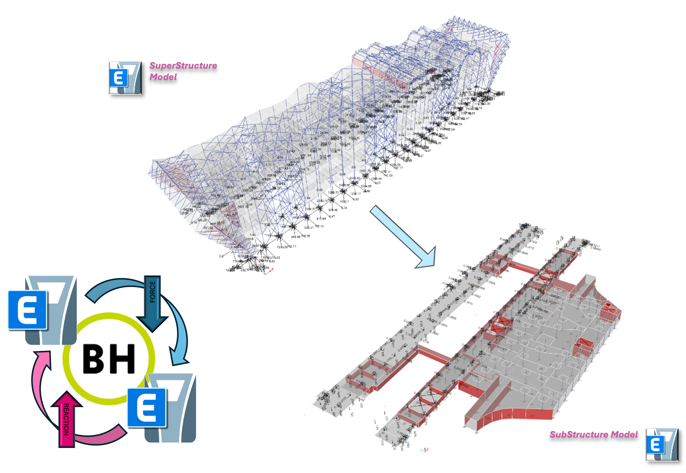
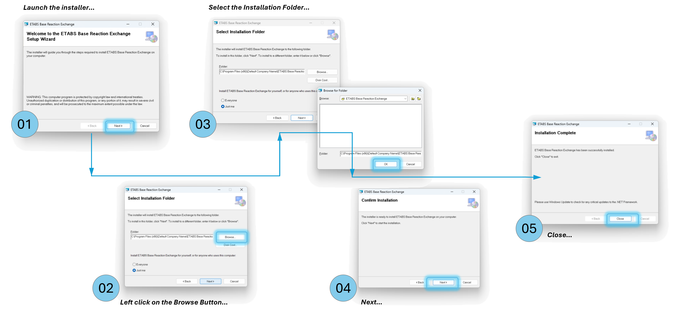
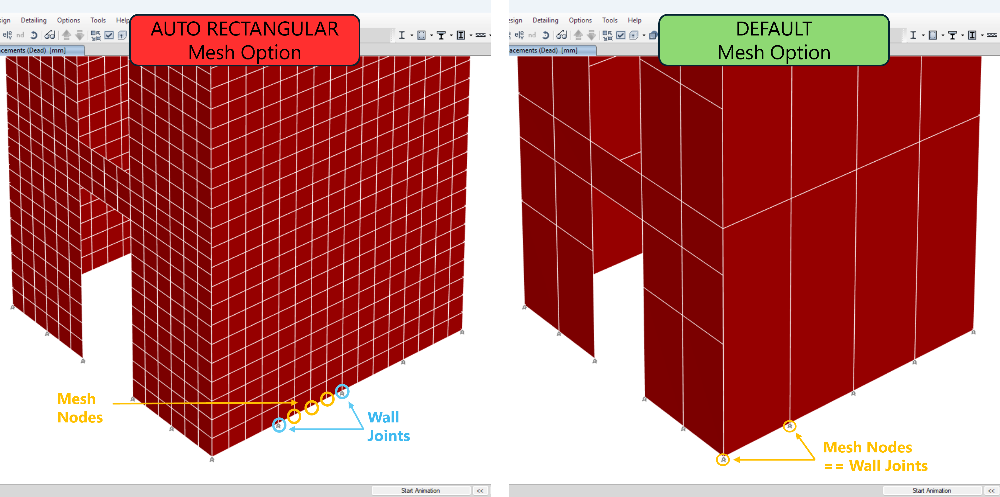
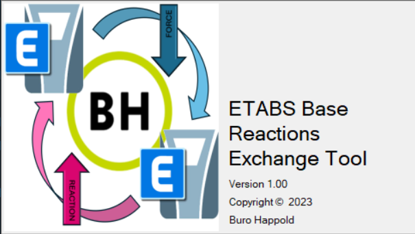
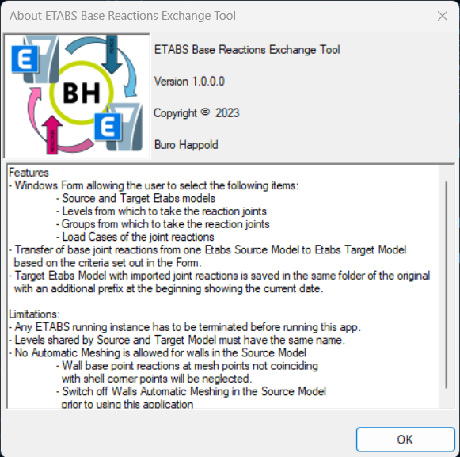
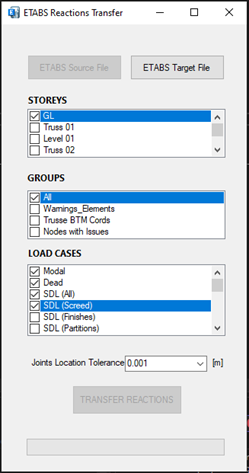
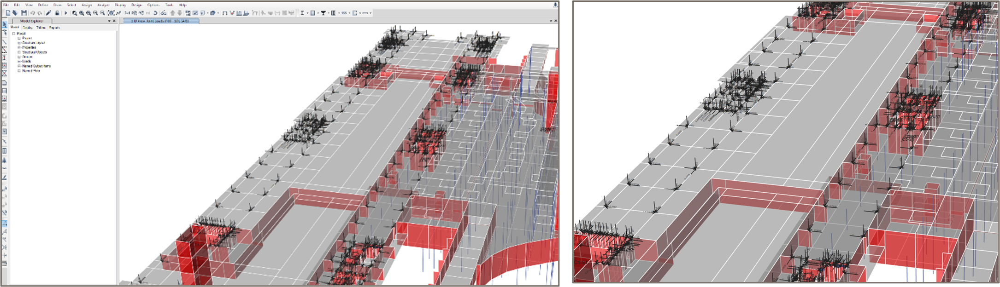

# ETABS Base Reactions Exchange Tool 🏗️

A Windows Desktop application developed in **VB.Net** that enables engineers to seamlessly transfer **joint reactions** between different ETABS models based on multiple selection criteria.  
This tool eliminates the need for manual workflows with spreadsheets, saving significant time and reducing errors.

---

## 📖 Overview

The **ETABS Base Reactions Exchange Tool (BRE Tool)** transfers joint reactions from a **Source ETABS model** into a **Target ETABS model** as reversed point loads.  

Key features:
- Transfer reactions based on **Groups** and **Load Combos**.
- Handle misalignment between models with a **customizable location tolerance**.
- Save outputs as new ETABS models with clear naming conventions.
- Simplify workflows that would otherwise require multiple spreadsheets.

  

---

## ⚙️ Installation

1. Run the provided **MSI installer**.
2. Select the installation folder (e.g. `C:\Users\<username>\ETABSPlugins`).
3. Click **Next** until installation completes.
4. A new folder `ETABS BRE Tool/` will be created containing all required files.
5. A desktop shortcut will be added automatically.

  

---

## 🏗️ ETABS Model Setup

Before running the tool, ensure:

- ✅ No ETABS instances are running (check Task Manager).
- ✅ Shared levels between Source and Target models have **identical names**.
- ✅ **Automatic Wall Meshing** is switched off in the Source model.
- ⚠️ Only **Linear Static Load Cases** are currently supported.

  

---

## 🖥️ User Interface

### Splash Screen
Displays logo, name, version, and copyright.

  

### AboutBox
Shows **features** and **limitations** of the tool. Always check this when new versions are released.

  

### Inputs Form
The main window where users configure the transfer:

- **ETABS Source File** selection
- **Storeys** (choose one shared level)
- **Groups** (filter base joints)
- **Load Cases** (select multiple)
- **Joints Location Tolerance** (meters)
- **ETABS Target File** selection
- **Transfer Reactions** button
- **Progress Bar**

  

---

## 📥 Inputs

- **Source File** → Select ETABS model to extract reactions.
- **Storeys** → Choose the shared level.
- **Groups** → Filter reactions by group.
- **Load Cases** → Select cases to transfer.
- **Tolerance** → Define acceptable offset between joints.
- **Target File** → Select ETABS model to receive reactions.

---

## 📤 Outputs

The tool generates a **new ETABS model** with transferred reactions as point loads.

**Output Naming Convention:**
BRE_Year_Month_Day_OriginalModelName.edb.  
**Example:** BRE_20251026_HOI Substructure.edb

  

---

## 🚧 Limitations

- Only **Linear Static Load Cases** supported.
- Wall reactions at mesh points not coinciding with shell corner points are neglected.
- Non-linear load case support planned for future releases.

---

## 📌 License

---
